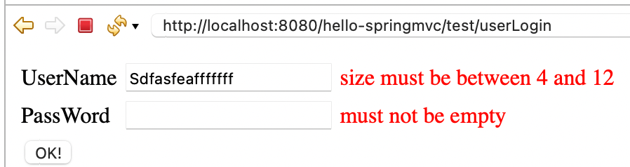
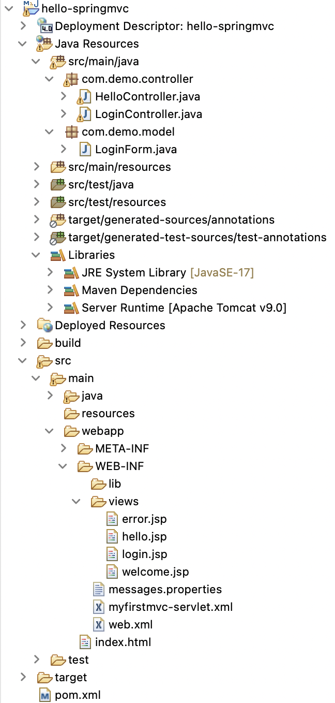

# spring-mvc-project

This is a Spring MVC Form Validation Project with Bean Validation API created in Spring Tool Suite. In this project, I developed a login form in Spring MVC with validation constraints for the two fields `username` and `password`, as shown below



Here is my project structure


My `pom.xml` file looks like below. Apart from standard Spring MVC artifacts, I also added hibernate-validator dependency in this project.
```
<project xmlns="http://maven.apache.org/POM/4.0.0"
	xmlns:xsi="http://www.w3.org/2001/XMLSchema-instance"
	xsi:schemaLocation="http://maven.apache.org/POM/4.0.0 https://maven.apache.org/xsd/maven-4.0.0.xsd">
	<modelVersion>4.0.0</modelVersion>
	<groupId>hello-springmvc</groupId>
	<artifactId>hello-springmvc</artifactId>
	<version>0.0.1-SNAPSHOT</version>
	<packaging>war</packaging>

	<dependencies>
		<dependency>
			<groupId>org.springframework</groupId>
			<artifactId>spring-webmvc</artifactId>
			<version>5.3.30</version>
		</dependency>
		
		<!-- https://mvnrepository.com/artifact/org.hibernate/hibernate-validator -->
		<dependency>
			<groupId>org.hibernate</groupId>
			<artifactId>hibernate-validator</artifactId>
			<version>6.1.0.Final</version>
		</dependency>
	</dependencies>

	<build>
		<plugins>
			<plugin>
				<artifactId>maven-compiler-plugin</artifactId>
				<version>3.8.1</version>
				<configuration>
					<release>17</release>
				</configuration>
			</plugin>
			<plugin>
				<artifactId>maven-war-plugin</artifactId>
				<version>3.2.3</version>
			</plugin>
		</plugins>
	</build>
</project>
```

My Spring configuration file `web.xml` looks like below:
```
<?xml version="1.0" encoding="UTF-8"?>
<web-app xmlns:xsi="http://www.w3.org/2001/XMLSchema-instance"
	xmlns="http://xmlns.jcp.org/xml/ns/javaee"
	xsi:schemaLocation="http://xmlns.jcp.org/xml/ns/javaee http://xmlns.jcp.org/xml/ns/javaee/web-app_4_0.xsd"
	id="WebApp_ID" version="4.0">
	<display-name>hello-springmvc</display-name>

	<servlet>
		<servlet-name>myfirstmvc</servlet-name>
		<servlet-class>org.springframework.web.servlet.DispatcherServlet</servlet-class>
		<load-on-startup>1</load-on-startup>
	</servlet>

	<servlet-mapping>
		<servlet-name>myfirstmvc</servlet-name>
		<url-pattern>/test/*</url-pattern>
	</servlet-mapping>

	<welcome-file-list>
		<welcome-file>index.html</welcome-file>
	</welcome-file-list>
</web-app>
```

My Spring Configuration file `myfirstmvc-servlet.xml` is like below. Here, I use `messageSource` bean to read the localized data from resource bundles. Rest of the part is to support annotations, view resolvers and providing package to scan for Controller classes and other components.
```
<?xml version="1.0" encoding="UTF-8"?>
<beans xmlns="http://www.springframework.org/schema/beans"
	xmlns:xsi="http://www.w3.org/2001/XMLSchema-instance"
	xmlns:context="http://www.springframework.org/schema/context"
	xmlns:mvc="http://www.springframework.org/schema/mvc"
	xsi:schemaLocation="http://www.springframework.org/schema/beans http://www.springframework.org/schema/beans/spring-beans.xsd
		http://www.springframework.org/schema/context http://www.springframework.org/schema/context/spring-context-4.3.xsd 
		http://www.springframework.org/schema/mvc http://www.springframework.org/schema/mvc/spring-mvc.xsd">

	<context:annotation-config />
	<context:component-scan base-package="com.demo" />

	<bean
		class="org.springframework.web.servlet.view.InternalResourceViewResolver">
		<property name="prefix" value="/WEB-INF/views/" />
		<property name="suffix" value=".jsp" />
	</bean>

	<bean id="myBeansValidator"
		class="org.springframework.validation.beanvalidation.LocalValidatorFactoryBean" />

	<mvc:annotation-driven
		validator="myBeansValidator" />

	<bean id="messageSource"
		class="org.springframework.context.support.ReloadableResourceBundleMessageSource">
		<property name="basename" value="/WEB-INF/messages" />
	</bean>

</beans>
```

Customized Form Validation Error Messages Resource Bundle in `messages.properties`:
```
# NotEmpty validation messages
NotEmpty.loginForm.username = UName can't be empty!
NotEmpty.loginForm.password = PW can't be empty!!

# Size validation messages
Size.loginForm.username = UName size is btwn 4/12...

# All other labels, headings, and titles
ecomm.customers.login.page.title = My EComm Login Page!
ecomm.customers.login.page.uname.label = User NAME
ecomm.customers.login.page.pword.label = Pass WORD
ecomm.customers.login.page.submit.label = LOGIN Now!

```